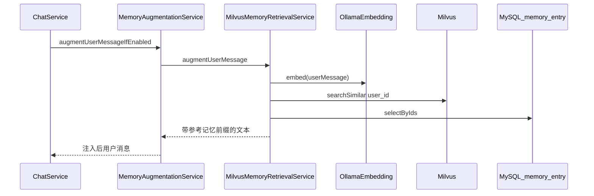

# v0.6 概要设计

## 1. 模块划分

| 包 / 模块 | 职责 |
|-----------|------|
| `cn.lysoy.jingu3.memory` | `MemoryService`、条目 CRUD（当前为创建与列表）、实体与 Mapper |
| `cn.lysoy.jingu3.memory.vector` | `OllamaEmbeddingClient`、`MilvusMemoryVectorService`、`MemoryVectorIndexer` |
| `cn.lysoy.jingu3.memory.injection` | `MilvusMemoryRetrievalService`（向量检索拼装）、`MemoryAugmentationService`（编排注入入口） |
| `cn.lysoy.jingu3.memory.cache` | `MemoryEntryListCache`（Redis 可选） |
| `cn.lysoy.jingu3.controller.MemoryController` | `POST/GET /api/v1/memory/entries`（`jingu3.memory.api-enabled`） |

## 2. 数据流（记忆注入）

**条件**：`jingu3.memory.injection-enabled=true` 且 `jingu3.milvus.enabled=true`；否则 Aug 直接返回原文。

## 3. 持久化边界

| 存储 | 内容 |
|------|------|
| MySQL | `memory_entry`、`fact_metadata`、`memory_embedding`（Flyway V4、V5）；可选 V6 用户/会话/技能表（与记忆解耦，见物化清单） |
| Redis | 列表缓存键：`jingu3:mem:list:v1:{userId}:{maxListSize}`（见 `RedisMemoryEntryListCache`） |
| Milvus | 集合默认 `jingu3_memory`；字段见 [milvus-collection-design.md](./milvus-collection-design.md) |

## 4. 配置分层

- 基线：[application.yml](../../agent-jingu3-cs-server/src/main/resources/application.yml) 中 `jingu3.memory.*`、`jingu3.redis.*`、`jingu3.milvus.*`
- 本地覆盖：复制 `application-local.yml.example` 为 `application-local.yml`，`spring.profiles.active=dev,local`

## 5. 修订记录

| 日期 | 版本 | 说明 |
|------|------|------|
| 2026-04-13 | 0.1 | 初稿：与当前包结构一致 |
