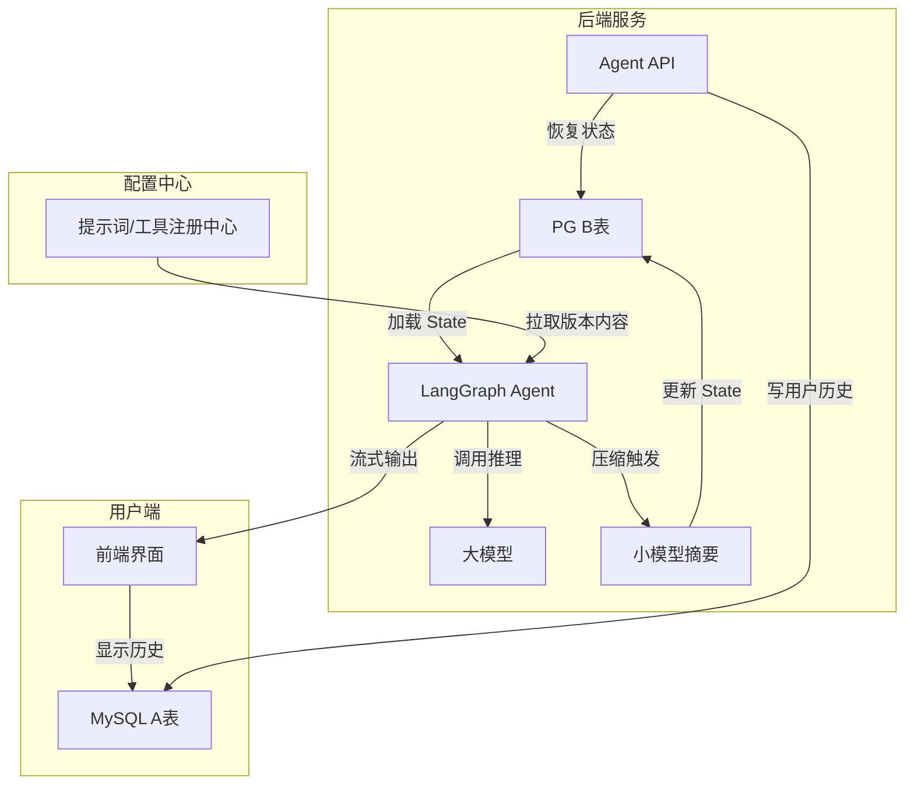

# 企业级 AI Agent 上下文工程范式详解v0.1：双表双模型架构

本篇章将我们讨论中形成的**上下文管理核心范式**单独抽离，进行系统化、深度的阐述。该范式解决了长对话场景下“上下文爆炸、Token 超限、记忆丢失、版本冲突”等核心痛点。

---

## 一、核心理念：分离关注点（Separation of Concerns）

传统的 Agent 开发常将“给用户看的聊天记录”与“给 LLM 推理用的上下文”混为一谈，导致：
- 上下文被无意义的 UI 格式污染。
- 工具调用内部细节泄露给用户。
- 历史记录无法独立归档与审计。
- 提示词/工具升级引发历史会话“时空错乱”。

**双表双模型架构**从根本上将二者分离：

| 维度 | **A 账本（用户视图）** | **B 账本（Agent 视图）** |
|:---|:---|:---|
| **表名** | `user_conversation_history` | `langgraph_checkpoints` |
| **存储内容** | 过滤后的纯人类可读对话（User / Assistant） | 完整 State 快照，包含 `messages`、工具调用 JSON、中间状态 |
| **观看者** | 前端用户界面 | LLM、LangGraph 执行器 |
| **存储介质** | MySQL / PostgreSQL（永久） | PostgreSQL / Redis（热数据 + TTL） |
| **数据量** | 每条消息一行，可长期归档 | 每个 Checkpoint 一个 JSON 大字段，自动淘汰 |
| **变更频率** | 追加为主 | 每次节点执行后覆盖/新增快照 |

---

## 二、双表设计详解

### 2.1 A 表：`user_conversation_history`（用户可见历史）

```sql
CREATE TABLE user_conversation_history (
    id BIGINT AUTO_INCREMENT PRIMARY KEY,
    user_id BIGINT NOT NULL,
    session_id VARCHAR(255) NOT NULL,      -- 对应 B 表的 thread_id
    role ENUM('user', 'assistant', 'system') NOT NULL,
    content TEXT NOT NULL,                 -- 已经过滤掉工具调用细节的纯文本
    tokens_used INT DEFAULT 0,
    created_at TIMESTAMP DEFAULT CURRENT_TIMESTAMP,
    INDEX idx_user_session (user_id, session_id)
);
```

**职责**：
- 为前端提供**干净、可分页、可搜索**的聊天记录。
- 永久保留，用于合规审计、用户回看、数据分析。
- **不受 Agent 内部状态变化的影响**（例如压缩 B 表不会删除 A 表记录）。

### 2.2 B 表：`langgraph_checkpoints`（Agent 内部状态快照）

```sql
CREATE TABLE langgraph_checkpoints (
    checkpoint_id VARCHAR(255) PRIMARY KEY,
    thread_id VARCHAR(255) NOT NULL,       -- 会话标识，与 A 表 session_id 关联
    checkpoint_ns VARCHAR(255) DEFAULT '',
    parent_checkpoint_id VARCHAR(255),
    state_data JSON NOT NULL,              -- 核心：完整的 AgentState
    metadata JSON,
    created_at TIMESTAMP DEFAULT CURRENT_TIMESTAMP,
    INDEX idx_thread_id (thread_id)
);
```

**`state_data` 内部结构示例**：
```json
{
  "messages": [
    {"type": "SystemMessage", "content": "系统提示词版本: v1.2.3"},
    {"type": "UserMessage", "content": "帮我查天气"},
    {"type": "AiMessage", "content": null, "toolExecutionRequests": [...]},
    {"type": "ToolExecutionResultMessage", "content": "晴 25℃"},
    {"type": "AiMessage", "content": "今天北京晴天..."}
  ],
  "intent": "RESEARCH",
  "search_queries": ["北京天气"],
  "system_prompt_version": "v1.2.3",
  "tool_versions": {"weather_tool": "v2.1.0"}
}
```

**职责**：
- 作为 LangGraph 状态机的持久化后端，保证对话中断后可无缝恢复。
- 存储完整的推理轨迹，供调试与审计。
- 支持上下文压缩（直接在 `state_data.messages` 上操作）。

---

## 三、双模型协同机制：大模型推理 + 小模型压缩

### 3.1 为什么需要两个模型？

| 角色 | 模型选型 | 触发时机 | 目标 |
|:---|:---|:---|:---|
| **推理模型** | GPT-4 / Claude-3.5 | 每次用户请求 | 高质量回答、工具调用 |
| **压缩模型** | GPT-3.5-turbo / 本地小模型 | 上下文长度超阈值时 | 快速生成摘要，释放 Token 空间 |

### 3.2 压缩触发与执行流程（用户无感设计）

```text
用户点击“发送” 
    │
    ▼
┌──────────────────────────────────────────────────┐
│ 1. 从 B 表 (Redis/PG) 恢复 State                 │
└──────────────────────────────────────────────────┘
    │
    ▼
┌──────────────────────────────────────────────────┐
│ 2. Token 计数检查                                 │
│    if (tokenCount > 模型上限 * 80%) {            │
│        启动异步压缩任务（或同步快速压缩）           │
│    }                                             │
└──────────────────────────────────────────────────┘
    │
    ▼
┌──────────────────────────────────────────────────┐
│ 3. 调用大模型生成回答（流式）                      │
│    - 若压缩已提前完成，使用压缩后的 messages       │
│    - 若压缩未完成，使用稍长但未超限的 messages     │
└──────────────────────────────────────────────────┘
    │
    ▼
┌──────────────────────────────────────────────────┐
│ 4. 用户看到逐字输出，完全感知不到压缩过程           │
└──────────────────────────────────────────────────┘
```

**异步压缩细节**（推荐方案）：
- 在第 2 步检测到需要压缩时，**不阻塞当前请求**，直接进入第 3 步。
- 后台线程异步执行：
    1. 取 `messages` 的前 N 轮对话。
    2. 调用小模型生成摘要（如 *“用户之前询问了 Java 内存模型，助手解释了堆与栈的区别。”*）。
    3. 将 `messages` 中的对应原始消息替换为一条 `SystemMessage`（摘要）。
    4. 将修改后的 `State` 写入 B 表，覆盖旧 Checkpoint。
- **下一次**用户发消息时，恢复的就是已压缩的轻量状态。

**同步压缩**（简单场景）：
- 若小模型响应极快（< 200ms），可在第 2 步同步完成压缩后再调大模型。
- 优点：实现简单；缺点：首 Token 延迟略微增加。

---

## 四、版本化指针策略：告别“时空错乱”

### 4.1 问题场景
- 系统提示词从 v1 升级到 v2（例如增加禁止回答政治问题的规则）。
- 工具 `weather_tool` 从 v1（返回 JSON）升级到 v2（返回自然语言）。
- 用户两天后继续旧会话，若仍使用旧版本内容，行为不一致；若强制用新版本，可能不兼容。

### 4.2 解决方案：存指针，不存内容

在 B 表的 `state_data` 中仅存储**版本号**，而非实际内容：

```json
{
  "system_prompt_version": "v1.2.3",
  "tool_versions": {
    "weather_tool": "v2.1.0",
    "calculator": "v1.0.0"
  }
}
```

**恢复流程**：
```java
// 1. 从 Checkpoint 恢复 State
AgentState state = checkpointer.get(threadId);

// 2. 根据版本号从注册中心拉取实际内容
String systemPrompt = promptRegistry.get(state.getSystemPromptVersion());
Tool actualTool = toolRegistry.get("weather_tool", state.getToolVersions().get("weather_tool"));

// 3. 注入到当前执行上下文
context.setSystemPrompt(systemPrompt);
context.bindTool(actualTool);
```

**版本兼容策略**：
- **向后兼容**：新版本工具必须兼容旧版本输入输出格式。
- **降级提示**：若旧版本工具已下线，返回友好提示：“您正在继续一个旧会话，部分功能已更新，建议开启新对话。”

---

## 五、完整数据流图



---

## 六、核心代码示例

### 6.1 恢复 State 并注入版本化内容

```java
public AgentState prepareState(String threadId) {
    // 1. 从 B 表加载检查点
    Checkpoint checkpoint = checkpointer.get(threadId);
    AgentState state = checkpoint != null ? 
        deserialize(checkpoint.getStateData()) : new AgentState();

    // 2. 注入当前版本的系统提示词（不存入 State）
    String promptVersion = state.getSystemPromptVersion();
    String actualPrompt = promptRegistry.get(promptVersion);
    state.setRuntimeSystemPrompt(actualPrompt);

    // 3. 绑定对应版本的工具
    Map<String, String> toolVersions = state.getToolVersions();
    List<Object> tools = toolRegistry.getToolsByVersions(toolVersions);
    state.setRuntimeTools(tools);

    return state;
}
```

### 6.2 上下文压缩服务

```java
@Service
public class ContextCompressionService {
    @Autowired
    private ChatLanguageModel summarizerModel; // 小模型
    
    @Async
    public void compressIfNeeded(String threadId, List<ChatMessage> messages) {
        int tokenCount = tokenCounter.count(messages);
        if (tokenCount > THRESHOLD) {
            String summary = summarizerModel.generate(
                "请将以下对话历史压缩为一段简短的摘要：\n" + messages.subList(0, 10)
            );
            // 用摘要替换前10条消息，并写回 B 表
            List<ChatMessage> compressed = new ArrayList<>();
            compressed.add(SystemMessage.from("对话历史摘要: " + summary));
            compressed.addAll(messages.subList(10, messages.size()));
            checkpointer.put(threadId, new AgentState(compressed));
        }
    }
}
```

---

## 七、范式价值总结

| 痛点 | 传统方案 | 本范式解决方案 |
|:---|:---|:---|
| 上下文过长导致 Token 爆炸 | 手动截断或报错 | **小模型智能摘要 + 异步压缩** |
| 工具调用细节暴露给用户 | 前端需额外过滤逻辑 | **A/B 表物理隔离，A 表仅存清洗后内容** |
| 版本升级后历史会话行为异常 | 强制新版本或忽略 | **存指针不存内容，运行时动态注入** |
| 对话中断后无法恢复 | 依赖前端传全量历史 | **Checkpoint 自动持久化与恢复** |
| 用户翻看历史记录性能差 | 解析 JSON 大字段 | **A 表独立索引，分页查询毫秒级** |

---

## 八、实施建议

1. **先落地 B 表持久化**：使用 `PostgresSaver` 替代默认内存 Checkpointer，这是基石。
2. **再接入 A 表写入**：在 Agent 回复最终答案后，异步写入清洗后的用户消息和助手回答。
3. **压缩策略逐步迭代**：初期可用简单滑动窗口，待流量稳定后再引入摘要模型。
4. **版本化从提示词开始**：先对系统提示词实施版本管理，工具版本化可在工具数量增多后跟进。

这套范式已在多个中大型 Agent 项目中验证，能够支撑十万级会话的平稳运行，并显著降低 Token 成本和运维复杂度。