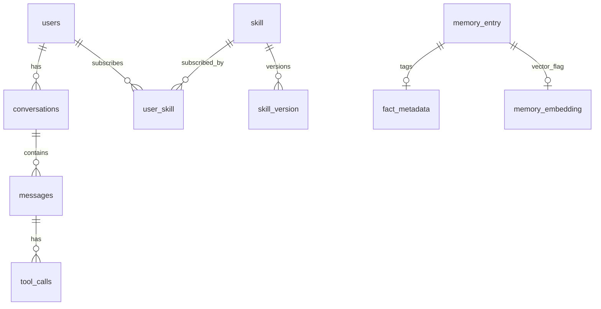

# 系统数据存储：完整物化清单与测试数据

本文给出 **MySQL 全表**、**Elasticsearch 索引**、**MinIO 桶**、**Milvus 集合**、**Neo4j 约束与种子** 的可执行定义，以及 **Redis 键示例** 与 **联调测试数据** 落点。权威架构说明见 [系统数据存储方案.md](./系统数据存储方案.md)。

---

## 1. MySQL

### 1.1 迁移脚本位置（Flyway）

| 版本 | 文件 | 内容 |
|------|------|------|
| V1 | [V1__scheduled_task.sql](../data/migration/V1__scheduled_task.sql) | `scheduled_task` |
| V2 | [V2__hitl_approval.sql](../data/migration/V2__hitl_approval.sql) | `hitl_approval` |
| V3 | [V3__dialogue_state.sql](../data/migration/V3__dialogue_state.sql) | `dialogue_state` |
| V4 | [V4__memory_m1.sql](../data/migration/V4__memory_m1.sql) | `memory_entry`、`fact_metadata` |
| V5 | [V5__memory_embedding.sql](../data/migration/V5__memory_embedding.sql) | `memory_embedding` |
| V6 | [V6__identity_chat_skill.sql](../data/migration/V6__identity_chat_skill.sql) | `users`、`conversations`、`messages`、`tool_calls`、`skill`、`skill_version`、`user_skill` |
| V7 | [V7__user_prompt_cipher.sql](../data/migration/V7__user_prompt_cipher.sql) | `user_prompt_cipher`（原始用户提示词密文审计） |

构建时 `docs/data/migration/*.sql` 会复制到 `classpath:db/migration`（见 `agent-jingu3-cs-server/pom.xml`）。

### 1.2 表清单（汇总）

| 表名 | 用途 |
|------|------|
| users | 用户账号；`id` 建议 `VARCHAR(64)`，与单用户 `001` 及 `memory_entry.user_id` 对齐 |
| conversations | 会话头 |
| messages | 消息；`embedding_ref` 指向向量侧或业务向量键 |
| tool_calls | 工具调用记录 |
| skill | 技能目录元数据 |
| skill_version | 技能版本与 MinIO 前缀 |
| user_skill | 用户订阅技能 |
| memory_entry | 记忆条目 |
| fact_metadata | Fact 标签（挂 `memory_entry_id`） |
| memory_embedding | 已向量化标记（与 Milvus 记忆集合对账） |
| scheduled_task | 定时任务 |
| hitl_approval | 人在环审批 |
| dialogue_state | 侧栏 DST 状态 |
| user_prompt_cipher | 原始用户输入密文（AES-256-GCM）；与 `messages.content` 业务消息并存，用于审计；密钥由服务端配置提供 |

**可选演进**：生产环境可在回填用户后为 `memory_entry.user_id` 增加指向 `users(id)` 的外键；需在数据一致后单独迁移。

### 1.3 ER 关系（简图）



---

## 2. Elasticsearch

### 2.1 索引命名建议

| 索引 | 用途 |
|------|------|
| `jingu3-events` | 事件全文检索（与第二版 `events` 一致）；主键 `_id` 可用 `event_id` |
| `jingu3-messages`（可选） | 从 `messages` 同步的检索副本，关键词查历史 |

### 2.2 映射文件

- 事件：[events-index.json](../data/elasticsearch/events-index.json)（字段与 **11 种有向关系** 语义见 [事件模型与关系类型.md](./事件模型与关系类型.md)）  
- 消息：[messages-index.json](../data/elasticsearch/messages-index.json)

**创建示例**（索引名按需替换；需集群已安装 IK 分词器，否则去掉 `ik_smart_analyzer` 改用 `standard`）：

```http
PUT /jingu3-events
Content-Type: application/json

< 粘贴 events-index.json 全文 >
```

### 2.3 ILM（可选）

```json
PUT _ilm/policy/jingu3_events_policy
{
  "policy": {
    "phases": {
      "hot": { "min_age": "0ms", "actions": {} },
      "delete": { "min_age": "90d", "actions": { "delete": {} } }
    }
  }
}
```

### 2.4 测试数据（Bulk）

- [events-bulk.ndjson](../data/elasticsearch/events-bulk.ndjson)：`_index` 为 `jingu3-events`

```bash
curl -H "Content-Type: application/x-ndjson" -XPOST "localhost:9200/_bulk" --data-binary "@docs/data/elasticsearch/events-bulk.ndjson"
```

---

## 3. MinIO

### 3.1 桶清单

| 桶名 | 内容 |
|------|------|
| jingu3-skills | 技能包：`skills/{skillId}/{version}/...` |
| jingu3-documents | 用户上传文档 |
| jingu3-generated-code | Agent 生成代码 |
| jingu3-session-artifacts | 会话截图、临时产物 |
| jingu3-embeddings-cache | 大嵌入缓存文件（可选） |

### 3.2 初始化脚本

- Bash：[create-buckets.sh](../data/minio/create-buckets.sh)  
- PowerShell：[create-buckets.ps1](../data/minio/create-buckets.ps1)  

**示例对象键**（与技能种子一致）：

```
jingu3-skills/skills/dddddddd-eeee-4fff-aaaa-bbbbbbbbbbb1/1.0.0/SKILL.md
```

`skill.storage_path` 存逻辑前缀 `skills/{skillId}/{version}/` 即可。

---

## 4. Milvus

### 4.1 集合清单

| 集合名 | 主键 | 向量字段 | 标量 | 说明 |
|--------|------|----------|------|------|
| jingu3_memory | memory_entry_id (INT64) | embedding | user_id | 与 [milvus-collection-design.md](../v0.6/milvus-collection-design.md)、服务端 MVP 一致 |
| jingu3_event_vectors | event_id (VARCHAR) | vector | user_id, ts_ms | 事件语义检索，与 ES `event_id` 对齐 |

**度量与索引**：开发期可用 `FLAT` + `COSINE`（记忆）或 `IP`（事件，若向量未归一化可改 `L2`）；数据量上升后改 `IVF_FLAT` / `HNSW`（参数见选型第二版）。

**维度**：与 `jingu3.memory.embedding-dimension` / 嵌入模型一致；示例脚本默认 `1024`，以实际模型为准。

### 4.2 参考脚本

- Python：[collections-reference.py](../data/milvus/collections-reference.py)（创建集合与索引示例）

### 4.3 测试向量写入说明

测试数据**不建议**手写随机向量；联调步骤：

1. 用 Ollama `/api/embeddings` 对短句「要点：MySQL…」生成向量；  
2. 取 `evt_demo_001` 写入 `jingu3_event_vectors`；  
3. 对 `memory_entry` 某行 `summary+body` 写入 `jingu3_memory`。

---

## 5. Neo4j

### 5.1 标签与关系

| 类型 | 说明 |
|------|------|
| 节点 `:Event` | 属性至少：`id`（= ES `event_id`）、`type`、`timestamp`；建议 `user_id`（与 ES 一致） |
| 关系 `EVENT_LINK` | 有向 **A → B**；属性 `rel_kind`（11 种机器码）、可选 `confidence`；`rel_kind: OTHER_RELATION` 时 **必填** `explanation` |

关系语义与对偶类型见 [事件模型与关系类型.md](./事件模型与关系类型.md)。

### 5.2 种子脚本

- [event-graph-seed.cypher](../data/neo4j/event-graph-seed.cypher)

---

## 6. Redis（键示例，非 schema）

| 用途 | 示例键 | 值类型 |
|------|--------|--------|
| 会话上下文 | `session:{conversationId}:context` | Hash |
| STM | `stm:queue:{conversationId}` | List |
| 限流 | `rate:tool:{toolName}:{userId}` | String |
| 记忆列表缓存 | `jingu3:mem:list:v1:{userId}:{max}` | String(JSON) |

测试：

```
SET session:aaaaaaaa-bbbb-4ccc-dddd-eeeeeeee0001:context "{\"topic\":\"demo\"}" EX 1800
```

---

## 7. 联调测试数据（MySQL 种子）

手动执行（会插入业务数据，勿在生产直接跑）：

- [dev_seed.sql](../data/seed/dev_seed.sql)

内容包含：`users(001)`、会话与消息、一条 `tool_calls`、一条 `skill`/`skill_version`/`user_skill`、一条 `memory_entry`。

执行前请确认无唯一键冲突；可自建事务或先 `DELETE` 再 `INSERT`（演示环境）。

---

## 8. 跨组件 ID 对照（测试用）

| 概念 | MySQL / ES / Milvus / MinIO |
|------|---------------------------|
| 用户 | `users.id` = `001` |
| 会话 | `conversations.id` = `aaaaaaaa-bbbb-4ccc-dddd-eeeeeeee0001` |
| 消息 | `messages.id` = `bbbbbbbb-cccc-4ddd-eeee-ffffffff0002` |
| 事件 | ES `_id` / Neo4j `Event.id` / Milvus `event_id` = `evt_demo_001` |
| 技能 | `skill.id` = `dddddddd-eeee-4fff-aaaa-bbbbbbbbbbb1`，版本 `1.0.0` |

---

## 9. 修订记录

| 日期 | 说明 |
|------|------|
| 2026-04-13 | 初稿：V6 迁移、ES/MinIO/Milvus/Neo4j 物化文件与 dev_seed |
| 2026-04-13 | 事件要素与 11 种 `EVENT_LINK.rel_kind`；ES 映射与 Neo4j 种子对齐 [事件模型与关系类型.md](./事件模型与关系类型.md) |
